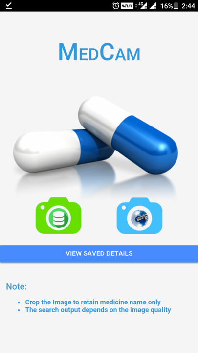

# MedCam
An App which allows to recognize a medicine by using google vision API and provide details of a medicine. You can also search related topic's about medicien using Web option in the app.

## About App:

- Ionic Framework is used to build the app.
- Php is used to develop the endpoints which are consumed in the app. These endpoints make calls to the db, get the details and send back those to the app.
- Query Language - mysql
- Database is Relational Database.
- APIS used - Google Vision API.

## ScreenShots

